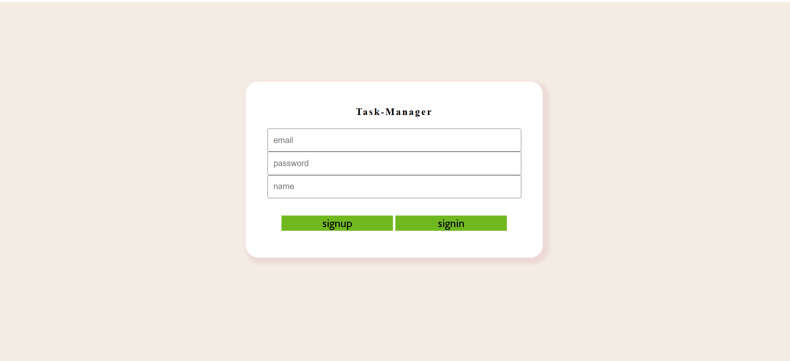
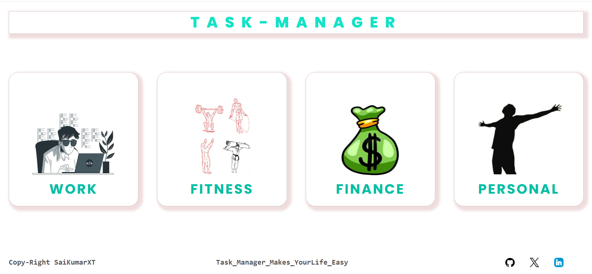
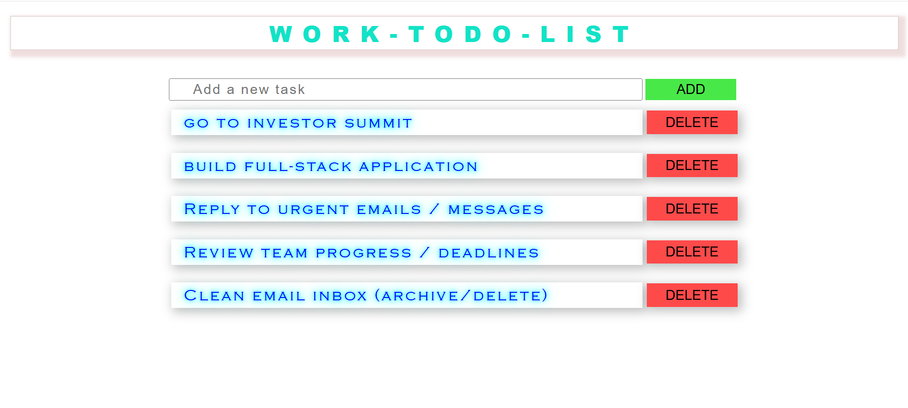
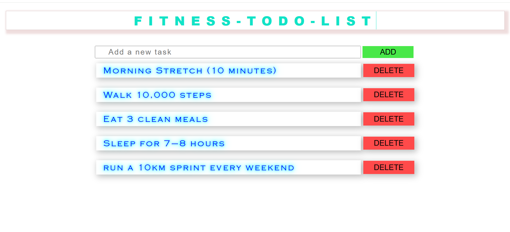
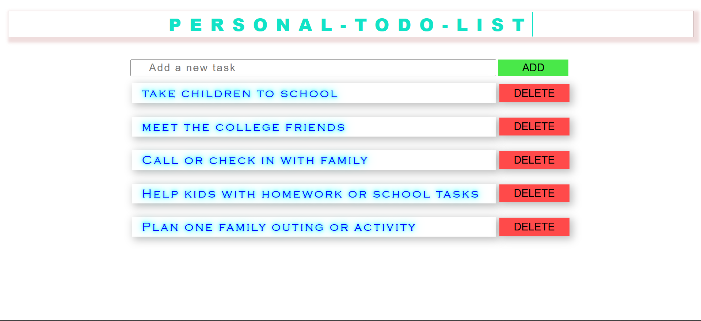

## 📸 Screenshots

### 🔐 Login Page

### 🏠 Home Page

### 📊 Dashboard View

### 🏃 Fitness Tasks

### 💰 Finance Tasks

### 🧘 Personal Tasks

# 🧠 Task Manager – End-to-End MERN To-Do Tracker

A full-stack task management web app built with **Node.js**, **MongoDB**, and **Vanilla JS** that helps users track tasks across four key life areas: **Work**, **Fitness**, **Finance**, and **Personal**. The app includes user authentication, protected routes, and persistent todo storage.

---

## 📂 Features

- ✅ **User Signup & Login** (with JWT & password hashing)
- 🔒 **Protected Todo Routes** per user
- 🏢 **Work Tasks**
- 🏃‍♂️ **Fitness Routines**
- 💰 **Finance Tracking**
- 🧘 **Personal Goals**
- 🧩 Modular structure for easy scaling
- 🎨 Clean and responsive UI (HTML + CSS only)
- 🗃️ MongoDB for persistent data storage

---

## 🚀 Tech Stack

| Frontend         | Backend        | Database   | Auth     |
|------------------|----------------|------------|----------|
| HTML/CSS/JS       | Node.js/Express | MongoDB Atlas | JWT      |

---

## 📁 Project Structure

task-manager-end-to-end/
│
├── public/
│ ├── images/
│ ├── finance.html
│ ├── fitness.html
│ ├── index.html
│ ├── personal.html
│ ├── work.html
│ ├── styles.css
│ ├── todos.css
│ ├── script.js
│ ├── loginpage.html
│ └── loginpage.css
│
├── db.js
├── index.js (main server)
├── package.json
└── README.md

yaml
Copy
Edit

---

You can now **copy and paste the entire `README.md`** content (including previous parts) into a file named `README.md` at the root of your project.

Would you like me to:
- Upload the `.md` file for you to download?
- Guide you in uploading it to GitHub?
